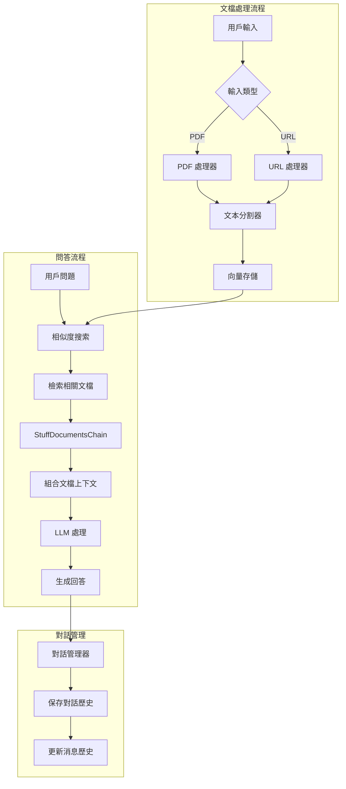

# AI 筆記本應用

用 LangChain 來做仿 [NotebookLM](https://notebooklm.google.com/) 的 AI 筆記本應用，可以處理 PDF 文件和網頁內容，並回答相關問題。

## 功能特點

- 上傳並處理 PDF 文件
- 輸入並處理網頁 URL
- 基於文檔內容回答問題
- 智能對話管理

## LangChain 工作流程



## 工作流程說明

1. **文檔處理流程**
   - 用戶可以上傳 PDF 文件或輸入 URL
   - 系統使用適當的加載器處理輸入
   - 文本分割器將內容分割成較小的片段
   - 將文本片段存儲到向量數據庫中

2. **問答流程**
   - 用戶提出問題
   - 系統在向量存儲中搜索相關文檔
   - 檢索到的文檔通過 StuffDocumentsChain 處理
   - 將文檔組合為完整上下文
   - 將上下文與問題一起發送給 LLM
   - LLM 生成基於文檔的回答

3. **對話管理**
   - 保存問答記錄到數據庫
   - 維護對話歷史
   - 更新消息歷史以支持上下文理解

## 安裝和運行

1. 安裝依賴：

   ```bash
   pipenv install
   ```

2. 配置環境變量：
   - 複製 `.env.example` 到 `.env`
   - 填入必要的 API 密鑰和配置

3. 運行應用：

   ```bash
   pipenv run python -m src.main
   ```

## 技術棧

- LangChain
- OpenAI
- ChromaDB
- BeautifulSoup4
- Rich

## 項目結構
